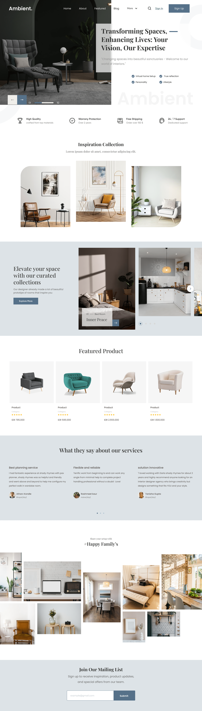

 <h1>Design's that  bring the  change</h1>
             

              
             

             

              
             
 #part1rightbox1>img{
    width: 190%;
    /* height: 100%; */
    /* object-fit: cover; */
 }
 #part1right>h1{
    font-weight: 100;
    position: absolute;
    font-family: voyage;
    font-size: 4vw;
   bottom: 2%;
    z-index: 9;
    
    mix-blend-mode: difference;
   color: #f7f7f7;
 }
 #part1rightbox2>img{
    width: 100%;
    /* height: 100%; */
    /* object-fit: cover; */
 }
#part1rightbox2{
    width: 20vw;
    height: 30%;
    background-color: rgb(128, 118, 233);
    position: absolute;
    left: 5%;
    top: 15%;
    overflow: hidden;
 }
#part1rightbox3{
    width: 20vw;
    height: 25%;
    background-color: rgb(128, 118, 233);
    position: absolute;
    left: 50%;
    top: 75%;
    overflow: hidden;
 }